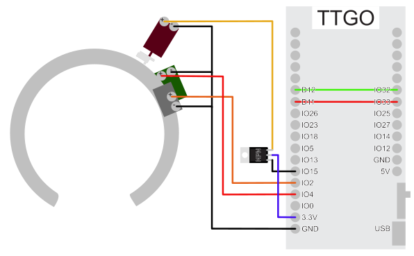

radforschung lock
=================

ESP32 based smart lock for bicycles and other shared mobility devices.

This is a work in progress. For more background see https://radforschung.org/log

## hardware prototype

for the prototype we're using a modified smart lock from china. as platform for the esp32 and lora a ttgo lora v2 is used.

## LoRaWAN

### Config

rename `src/config.sample.h` to `src/config.h` and insert your TTN application credentials.

### Messages

#### Lock Status

Lock messages are sent on the LoRaWAN port `1` and start with `0x01`. The second byte is the status:
 * `0x01` `0x01`: Lock Closed
 * `0x01` `0x02`: Lock Open

#### Location Info

Location info messages start with `0x02`. There are currently two location reporting methods: GPS and WiFi. While GPS receives the location on the lock, WiFi location can't calculated on the lock.

##### GPS
Sent on LoRaWAN port `10`.

tbd

##### WiFi
Sent on LoRaWAN port `11`.

The following bytes contain chunks of 7 bytes per found access point. The first 6 bytes contain the WiFi BSSID (MAC address), the 7th byte is `RSSI * -1`. Max number of transmitted access points is 7.
