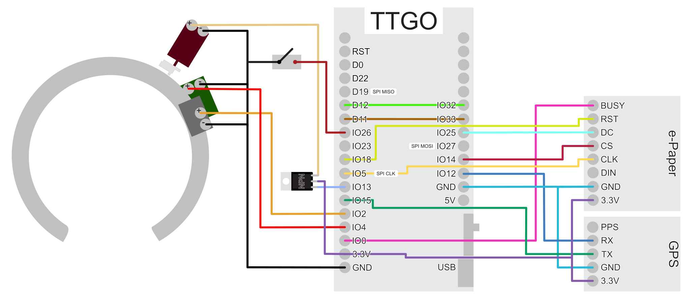

radforschung lock
=================

ESP32 based smart lock for bicycles and other shared mobility devices.

This is a work in progress. For more background see https://radforschung.org/log

### lora config

rename `src/config.sample.h` to `src/config.h` and insert your ttn application credentials.

## hardware prototype

for the prototype we're using an modified smart lock from china. as platform for the esp32 and lora a ttgo lora v2 is used.

